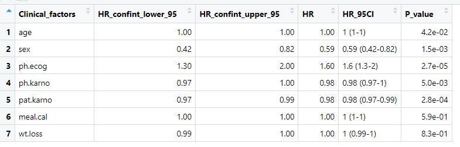
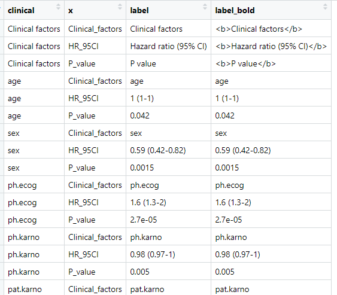
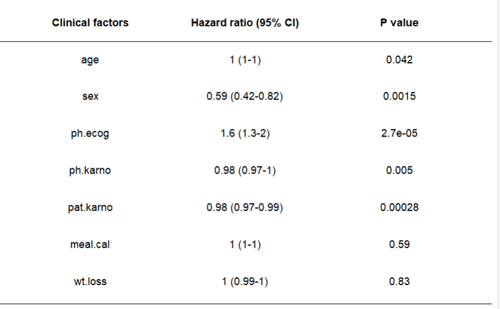
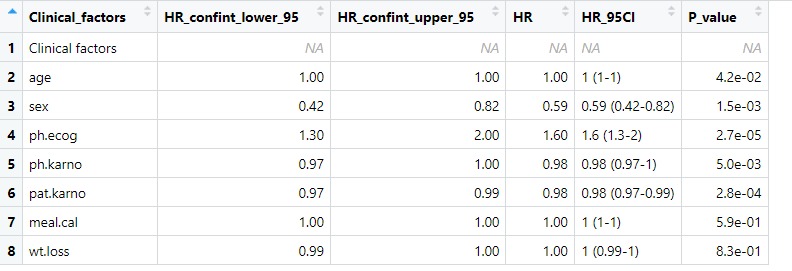
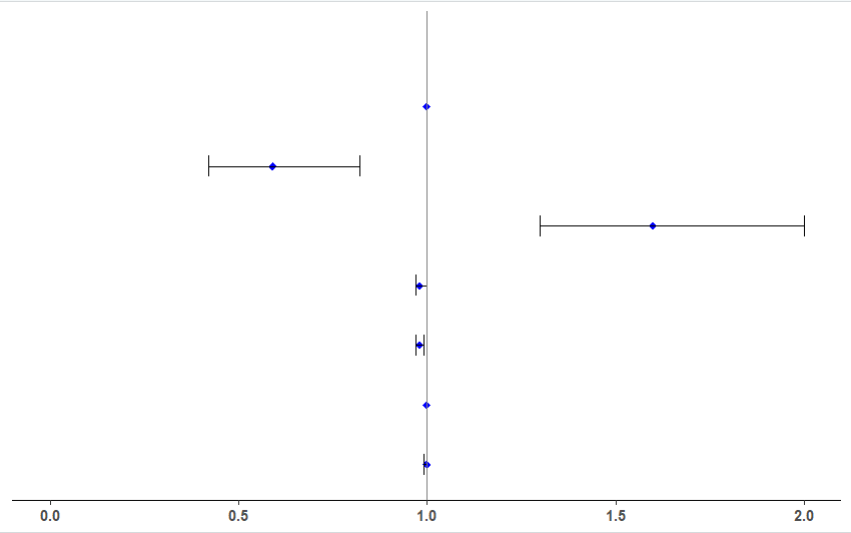
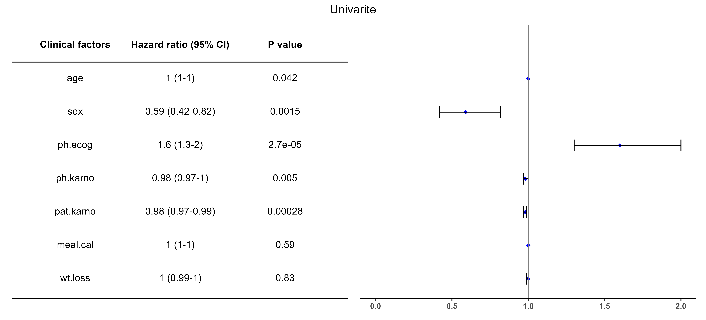

## 介绍

绘图数据`univ_cox`见今日次推《批量单因素COS回归分析》，因为这个代码网上太多了，肯定不能审`原创` ，又担心大家不方便复现，因此把这部分代码单独放到了次推上。

由于是复现某一风格的森林图，在原图上我不会改，所以写了个丑一点的森林图绘制代码。如果你拼图的时候遇到问题，一定看看我最后的小结部分。

大部分时间是放在了拼图上，从来没想过拼图会花我一天时间。另外，别人都吹ChatGPT，但是我的使用体验真的不咋滴，当然也有可能是与我用的ChatGPT 3.5 免费版本有关。

> **数据和全部代码获取**：文末赞赏  即可获取本文与全部代码（包括批量单因素cos回归分析部分）的百度网盘链接

## 绘图数据



## 代码

### 准备表格数据

```sh
# 准备数据----
## 将表格的列名和第一列均拷贝一份儿放到数据表中
tmp_df <- df %>% select(Clinical_factors, HR_95CI, P_value) %>%  
  #rbind(colnames(.),.) %>%  # df[1:nrow(df),]
  rbind(tab_header,.) %>%
  cbind("clinical" = .[,"Clinical_factors"],.)
tmp_df$clinical <- factor(tmp_df$clinical, levels = rev(tmp_df$clinical))

## 宽表格转长表格
tmp_df <- tmp_df %>% pivot_longer(cols = 2:ncol(.), names_to = "x", values_to = "label")

## 表格header内容替换与是否加粗。# table header and bold labels
###部分label加粗，即表格header加粗。使用geom_richtext实现加粗。
tmp_df$label_bold <- sapply(tmp_df$label, function(x){
  if(x %in% unlist(tab_header)){
    if(tab_header_bold){ # 是否给表格header行加粗
      paste0("<b>",x,"</b>") 
    }else{
      x
    }
    
  }else{
    x
  }
}, simplify = T) 
tmp_df
```

部分内容展示



### 表格图

```sh
p_tab <- ggplot(data = tmp_df,aes(x = x, y = clinical))+
  geom_tile(color = "white",fill = "white")+ #表格边框与填充
  geom_richtext(aes(label = label_bold),label.color = NA)+ # 启用ggtext并去掉边框
  #geom_text(aes(label = if_else(label %in% header, expression(bold(label)),label) ))+
  #geom_text(aes(label = label_bold))+
  # coord_cartesian(ylim = c(0,7))+
  # scale_x_discrete(expand = c(0,0))+
  # scale_y_discrete(expand = c(0,0))+
  theme_classic()+
  theme(legend.position = "none",
        axis.title = element_blank(),
        axis.text = element_blank(),
        axis.ticks = element_blank(),
        axis.line.x = element_line(linewidth = line_width),
        axis.line.y = element_blank(),
        text = element_text()
  )+
  geom_hline(yintercept = c(length(unique(tmp_df$clinical))- 0.5), linewidth = line_width)

p_tab  
```


### 误差棒绘制数据

```{r}
## 准备误差棒表格
### 通过添加一个空行，类对齐表格中的表头部分。
tmp_error <- rbind(rep(NA,ncol(df)),df)
tmp_error$Clinical_factors[1] <- tab_header[[1]] # "Clinical factors", tab_header[["Clinical_factors"]]

### 因子化排序
tmp_error$Clinical_factors <- factor(tmp_error$Clinical_factors, levels = rev(tmp_error$Clinical_factors))

### 尝试geom_path的数据准备
#tmp_error <- tmp_error %>% mutate(path_x = 1, path_y = c(rep(0, nrow(.)-1),nrow(.)-0.5))
tmp_error
```
数据内容展示



### 误差棒绘制

```r
p_errorbar <- ggplot(data = tmp_error)+
  geom_point(aes(x = HR, y = Clinical_factors), # 设置点
             shape = "diamond",
             color = "blue",
             size = 2
  )+
  geom_errorbarh(aes(xmin = HR_confint_lower_95, # 设置误差线
                     xmax =HR_confint_upper_95,
                     y = Clinical_factors),
                 linewidth = line_width, # 线的宽度
                 height = error_bar_height # 误差线两端的宽度
  )+
  # coord_cartesian(ylim = c(0, 8))+
  # scale_x_discrete(expand = c(0,0))+
  # scale_y_discrete(expand = c(0,0))+
  theme_classic()+
  theme(title = element_blank(),
        axis.line.x = element_line(linewidth = line_width), # 下坐标线
        axis.text.x = element_text(face = "bold"),
        axis.text.y = element_blank(),
        axis.line.y = element_blank(),
        axis.ticks.y = element_blank(),
        
  )+
  expand_limits(x=0)+
  #geom_hline(yintercept = c(nrow(tmp_error)-0.5), linewidth = line_width)+ #上坐标线
  # geom_path(aes(x=path_x, y = path_y))
  # annotate("segment",x=1,xend = 1,y=0,yend = nrow(tmp_error)-0.5)
  geom_vline(xintercept = ref_line, color = "grey50") # 绘制无效线
# geom_segment(aes(x =1, xend = 1, y = 0, yend = nrow(tmp_error)-0.5), inherit.aes = FALSE)

# geom_segment(aes(x =1, xend = 1, y = 0, yend = nrow(tmp_error)-0.5),
#              color = "grey60",linewidth = line_width,size = 0.1) 
p_errorbar
```



### 拼图

```sh
## aplot拼图：可用
# p <-  aplot::insert_left(p_errorbar, p_tab, width = 1)
## patchwork拼图：可用
p <- p_tab + p_errorbar + plot_annotation(title = plot_title,
                                     theme = theme(plot.title = element_text(hjust = 0.5)))
p
#ggsave(filename = "forest.pdf", plot = p, width = 11, height = 5)
```



## 小结

### 表格绘制

- 摘取好相应的结果列
- 为了绘制表的标题行，将列名转为第一行
- 将第一列复制一份放到前面，为了转为长表格。
- `geom_tile(color = "white",fill = "white")` 部分为冗余代码，但是依靠`geom_tile` 可以实现更复杂的内容。

- 利用`ggtext::geom_richtext` 实现部分标签的加粗，这里是加粗表头行
- 注意`geom_hline` 的位置描述

### 误差棒绘制

- 增加空行，并在第一列部分添加与`p_tab`中相应的坐标轴标题。`tmp_error$Clinical_factors[1] <- tab_header[[1]] # "Clinical factors"`
- 使用`expand_limits(x=0)` 让其标记出x坐标中的`0` 位置。

### 拼图

- `geom_segment` 、`annotate("segment",...)` 、`geom_path` 绘制无效线时，在拼图时坐标轴无法对齐。即使用`aplot::insert_left`也不行。
- 有建议使用`coord_cartesian(ylim)` 设置坐标轴范围**以对齐坐标轴**，但是图距离x轴会有较大距离，且与其它行分布不均匀，暂时不会调整。

- 最终还是选择了`geom_vline` 绘制无效线。
- 拼图可以使用`aplot::insert_left` 。同样两个图拼接，`aplot::insert_left` 在对齐坐标效果上并不完全等效于`aplot::insert_right`。一个稍有瑕疵时，可以尝试使用另一个。而且这个版本我不会添加拼图后的`title`
- 通过因子化排序，使用`patchwork`  进行拼图，并用`plot_annotation` 添加`title`。
